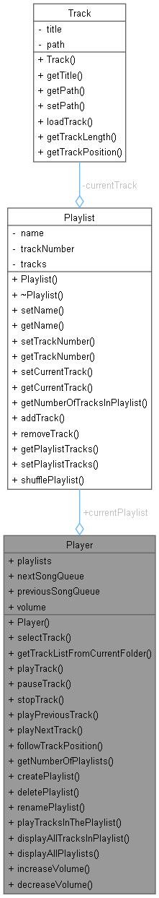

# **Muzikos grojimo programėlė**

**Komandos nariai:** Tomas Kazonas, Nojus Sandovas, Levon Airapetian

**Komandos pavadinimas:** Špotify

## **Projekto aprašymas**

Muzikos grojimo programėlė vartotojams suteikia įvairias galimybes,
įskaitant muzikos grojimą, naujų grojaraščių kūrimą ir jų tvarkymą. Vartotojai
gali lengvai valdyti dainas, kurti grojaraščius pagal savo skonį ir mėgstamas
dainas bei reguliuoti garso lygį. Programėlė leidžia vartotojams naudotis
įvairiomis funkcijomis, įskaitant:

•    **Grojaraščių valdymas:**
Vartotojai gali personalizuoti savo grojaraščius, pridėdami, šalindami dainas,
redaguodami grojaraščio pavadinimą. Yra galimybė pasirinkti, ar grojaraščius
norima sugroti vieną kartą arba juos kartoti. Taip pat yra galimybė sumaišyti
dainų eilės tvarką grojaraščiuose, kad dainos grotų atsitiktine tvarka.

•    **Dainų valdymas:**
Programėlė leidžia vartotojams groti, stabdyti, tęsti, dainas. Taip pat yra
galimybė pereiti prie ankstesnės arba sekančios dainos grojaraštyje.

•    **Garso reguliavimas:**
Vartotojai gali reguliuoti garso lygį pagal savo pageidavimus, kad būtų patogu
klausytis muzikos.

### [**Proof of concept**](https://www.youtube.com/watch?v=BZN2oEVn90A)

### Darbo apimties ir laiko ataskaita bei pažymio pasiskirstymas

|                   | Tomas                                        | Nojus                                                                       | Levon                                                                               |
| ----------------- | -------------------------------------------- | --------------------------------------------------------------------------- | ----------------------------------------------------------------------------------- |
| Darbas            | Projekto struktūra,<br />activity diagramos | Proof of concept +<br />demonstracija YouTube,<br />sukurta GitLab saugykla | Sugalvotas komandos<br /> pavadinimas, projekto <br />aprašymas, use-case diagrama |
| Laikas (iš viso) | 300 min.                                     | 45 min.                                                                     | 50 min.                                                                             |
| Pažymys          | 1,2 balo                                     | 0,9 balo                                                                    | 0,9 balo                                                                            |

## Back-end (P2)

### Panaudoti / atpažinti projektavimo šablonai

1. **Singleton Pattern:**
   „Player“ klasė elgiasi kaip viena, nes ji valdo muzikos ir grojaraščių grojimą visoje programoje. Tai užtikrina, kad yra tik vienas grotuvas
2. **Factory method šablonas:**

„Playlist“ klasėje yra metodas „getTrackListFromCurrentFolder()“, kuris veikia kaip factory-method. Jis sukuria ir grąžina „Track“ objektų sąrašą pagal dabartiniame aplanke esančius muzikos failus.

3. **Observer šablonas:**

Grotuvas leidžia vartotojams groti, pristabdyti, sustabdyti, pereiti prie kitos dainos arba grįžti į ankstesnį dainos. Šiuos veiksmus atlieka klasė „Player“. Kitos klasės, pvz., „Track“ ir „Playlist“, yra observer‘iai, reaguojantys į atkūrimo būsenos pokyčius.

4. **Iterator šablonas:**

„Player“ klasė kartoja grojaraščius ir grojaraščių takelius, naudodama indeksu pagrįstą iteraciją, leidžiančią vartotojams naršyti grojaraščius ir pasirinkti konkrečius takelius, kuriuos nori groti.

5. **Command šablonas:**

Player‘io valdymo srautas primena komandų modelio struktūrą. Vartotojo įvestys interpretuojamos player‘io, atliekant atitinkamus veiksmus, tokius kaip grojimas, sustojimas, praleidimas ir kt.

##### Šie dizaino šablonai pagerina kodų bazės:

* Kodo organizavimo ir priežiūros tobulinimą.
* Funkcionalumo enkapsuliavimą
* Lengvesnis išplėtimas, leidžiantis lengviau pridėti naujų funkcijų ar modifikacijų.
* Kūrėjų kodo skaitomumo ir supratimo gerinimas.

### Klasių diagrama



### Darbo apimties ir laiko ataskaita bei pažymio pasiskirstymas

|                   | Tomas                                                                                                             | Nojus            | Levon                                                                                                                                                                          |
| ----------------- | ----------------------------------------------------------------------------------------------------------------- | ---------------- | ------------------------------------------------------------------------------------------------------------------------------------------------------------------------------ |
| Darbas            | Grojaraščių valdymas<br />(sukurti, ištrinti, pervadinti,<br /> paleisti grojaraštį),<br /> garso valdymas. | Dainų valdymas. | Grojaraščių valdymas<br />(pridėti, ištrinti dainą, kartoti, maišyti <br />grojaraštį, paleisti vieną kartą), <br />panaudoti / atpažinti projektavimo šablonai. |
| Laikas (iš viso) | 300 min.                                                                                                          | 120 min.         | 150 min.                                                                                                                                                                       |
| Pažymys          | 1,2 balo                                                                                                          | 0,9 balo         | 0,9 balo                                                                                                                                                                       |

### Programos paleidimas

Pirmiausia reikia programą sukompiliuoti.

```
make all
```

Tada paleidžiame programą:

```
MusicPlayer.exe
```

Esant reikalui galima viską išvalyti:

```
make clean
```

Arba perkurti:

```
make rebuild
```
